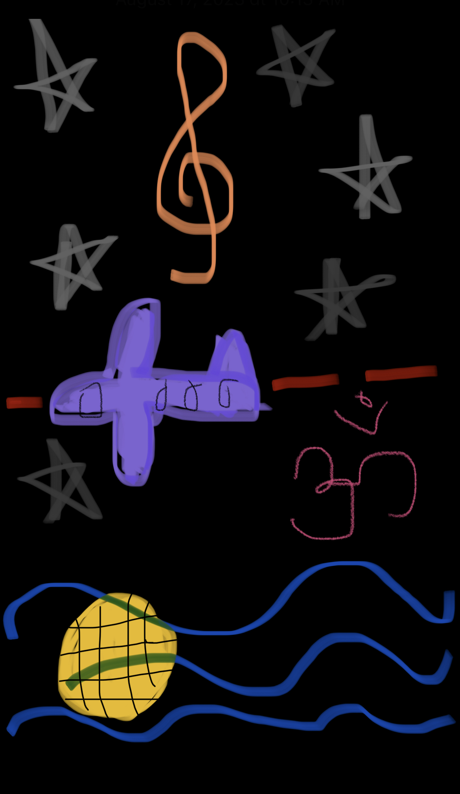

# Welcome to My Blog!
Hi, my name is Arushi Pandey! I am 15 years old and I am currently a sophmore at Del Norte HS. I am an Asian-American living in San Diego, CA. Here are a few of my interests.

## Quote of the Day!
<mark>"This will all make perfect sense one day!" <mark> 

## Hobbies/Schedule:
- Playing and Creating Music 
- Water Polo and Swim for HS
- Volunteering 
- Trying New Things
- Shopping
- Watching Netflix and Youtube
- Spending time with Friends and Family

|              My School Schedule:      
| Period 1: Intro to Finance 1|
| Period 2: AP Computer Science|
| Period 3: AP Chemistry|
| Period 4: Honors Humanities 1|
| Period 5: AP Calculus 1|

I love my tools! VsCode is my bestfriend it helps me write amazing codes and helped me help you reach this blog. I love my other tools, such as GitHub. GitHub helps me store and manage my code!

## Drawing of My Life:

<!-- ## Important Tools:

- Plans, Lists, [Scrum Boards](https://clickup.com/blog/scrum-board/) help you to track key events, show progress and record time.  Effort is a big part of your class grade.  Show plans and time spent!
- [Hacks(Todo)](https://levelup.gitconnected.com/six-ultimate-daily-hacks-for-every-programmer-60f5f10feae) enable you to stay in focus with key requirements of the class.  Each Hack will produce Tangibles.
- Tangibles or [Tangible Artifacts](https://en.wikipedia.org/wiki/Artifact_(software_development)) are things you accumulate as a learner and coder. 

 -->

[TRAVEL BLOG](http://0.0.0.0:4200/student/2023/08/23/Travel.html)

